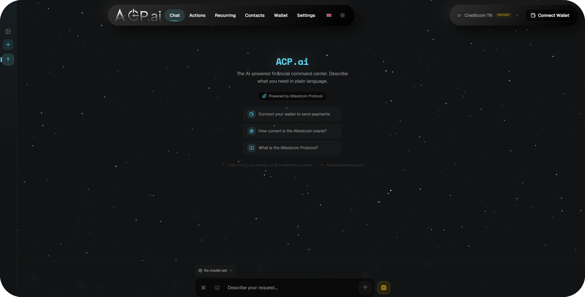
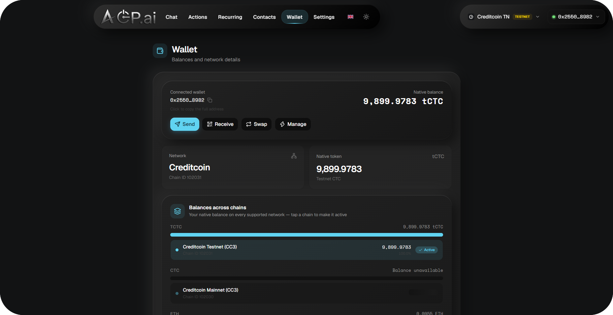
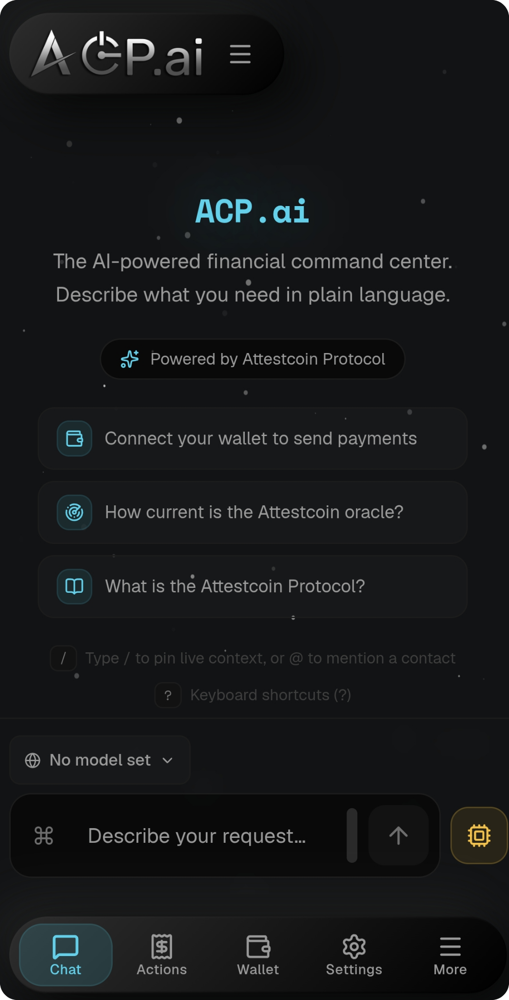
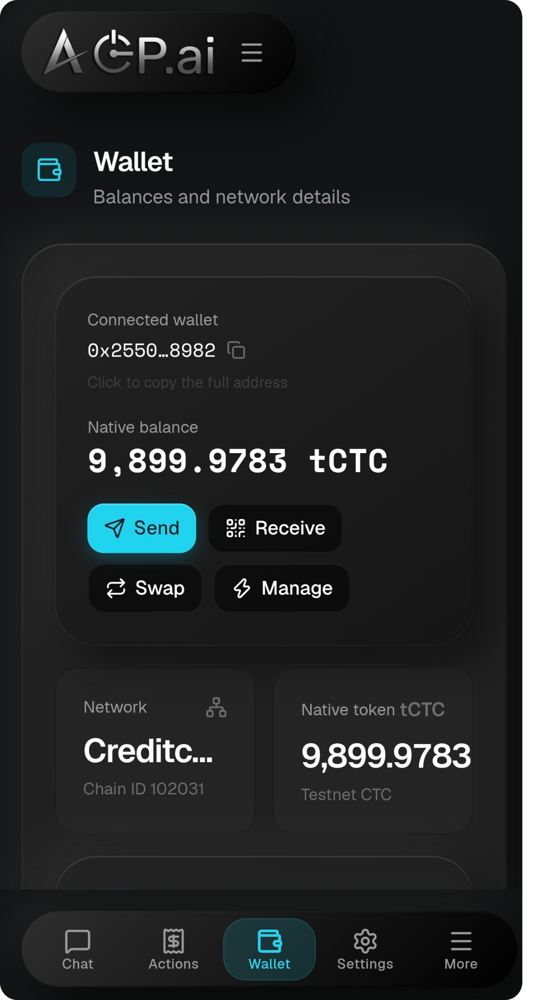

<p align="center">
  
</p>

<div align="center">


</div>

## Table of Contents

- [ACP.ai](#acpai---attested-credit-protocol)
  - [Why Attestcoin](#but-why-attestcoin)
  - [What the agent does](#what-the-agent-does-with-attestcoin)
  - [Protocol surface coverage](#protocol-surface-coverage)
  - [The end-to-end flow](#the-end-to-end-flow-payment--proof--certificate--release)
- [Features](#features)
- [Screenshots](#screenshots)
- [Supported Chains](#supported-chains)
- [Installation](#installation)
- [Full Architecture](#full-architecture)
- [Protocol correctness](#protocol-correctness-details-the-things-that-bite-if-you-skip-them)
- [Scope & roadmap](#scope--roadmap)

> [!NOTE]
> The demo video will be ready in a few days. For now, the project is deployed on web in beta form.
> Link URL (beta): https://acp-ai.vercel.app<br>
> The Track tracks for this project are the DeFi/AI Track.<br>
> Low commits are because local commits have been excluded.

# ACP.ai - Attested Credit Protocol

This project was built with the goal of simplifying the world of web2/web3 for crypto enthusiasts. Doesn't matter if you are a complete beginner, know some stuff about crypto or are an advanced professional; this project is for anyone who is brave enough to step into the world of crypto.

And there is always a gap between the current LLMs and the applications you use. And we closed that for crypto.

Say you want to make an entire token and deploy it on-chain, write a complex contract that does something big you have in mind. You can always use ChatGPT or its competitors, but it's truly a deep hassle for a beginner and time consuming for the normal person. Hallucinations, outdated data, etc. All of that will stop you before long. important to mention, ACP.ai narrows this risk rather than claiming to eliminate it: user-enabled skills constrain what patterns the model draws on when generating a contract, and every deployment — template or custom — passes through a mandatory confirmation card before anything is signed.

Or maybe you just want to automate something. Set up conditional actions. Say you wanted to, for instance, every Saturday, swap a specific token and instantly send it to an address. Or if you spend too much of something, you wanna get reminded you are spending too much.
With our application, you can set all that up in mere seconds. You're in control of everything.

And that raises another problem. What if you want to prove what you did? And that is where Attestcoin enters.

Attestcoin is not a feature of ACP.ai. ACP.ai is an application of Attestcoin. Every cross-chain fact the agent reasons about, every fund release it executes, and every proof a user exports is gated by on-chain verification on Creditcoin. no centralized oracle operator, no "trust us," no screenshots.

### But why Attestcoin?

A transaction hash is not proof. It's like a pointer - a promise that if you go look, you _might_ just find something. Screenshots can be faked, databases can be edited. Basically, it is not a proof.

Independent attestors on the Creditcoin network continuously attest source-chain block headers. From those attestations, anyone can generate two proofs for any transaction: a Merkle proof (the tx is in a specific block) and a continuity proof (that block is part of the real, finalized source chain). Any contract on Creditcoin can then verify those proofs synchronously on-chain through the Block Prover Precompile (0x…0FD2) — native runtime code, not an oracle operator, not our servers, not an LLM's guess.

One subtlety the docs insist on, and which we implement deliberately: the precompile proves inclusion, not execution success. A reverted tx can be "included" in an attested block. So ACP.ai closes that gap in three places — the on-chain EvmV1Decoder contract decodes the receipt status from the proven tx bytes (decode.ts), our ASCs require receiptStatus == 1 before releasing any funds (ConditionalRelease.sol, CrossChainSwapDestination.sol), and certificate verification re-checks it live (check #5 of 5).

Proof generation uses the protocol's hosted Proof Builder; proof verification runs on the Creditcoin chain itself. We never ask users to trust us — we hand them proofs the chain checks.

ACP.ai wires the whole protocol into your actions, automatically. With certificates that anyone can verify (Export any verified payment as a certificate or QR code).

### What the agent does with Attestcoin

1. **Proof-gated fund releases (the core feature).** `ConditionalRelease.sol` — an
   Attestcoin Smart Contract (ASC) we wrote and the agent deploys — escrows tCTC on
   Creditcoin and pays the beneficiary **only** when a Merkle + continuity proof of the
   condition transaction (a payment on Sepolia, an ERC-20 transfer, …) passes the Block
   Prover Precompile (`0x…0FD2`) _inside the same transaction_. Verification and release
   are atomic: there is no state where "verified but not released" can get stuck, and
   no state where funds move without the precompile accepting the proof.
2. **Cross-chain swaps, proof-gated on both legs.** ETH locks in `CrossChainSwapSource.sol`
   (Sepolia, emits `Locked`); tCTC releases from `CrossChainSwapDestination.sol` (Creditcoin)
   only against a verified proof of that lock — with trusted-source pinning, per-lock
   replay protection (`spentLocks`), lock-expiry gating (no double payout after refund),
   and the rate fixed at lock time.
3. **Autonomous attestation-aware decisions.** The agent's
   closed 28-tool registry includes 11 Attestcoin tools — it can check attestation
   status, _wait_ for a block to be attested, decode a proven transaction, verify a
   proof read-only, estimate verification cost, and submit proofs on-chain — so
   cross-chain reasoning runs on **cryptographically verified data, not model guesses**.
4. **Attestation-driven automation.** The automation engine's `attestation_ready`
   trigger fires user-defined actions when a payment's proof lands on Creditcoin
   (e.g. "when my payment to X is attested, notify me / release the escrow").
5. **Portable, third-party-verifiable certificates.** Any attested payment exports
   as a JSON certificate + QR. Anyone — including someone who has never used ACP.ai —
   can drop it into the certificate verifier, which re-runs **five live checks**:
   schema, internal consistency, Proof Builder attestation, on-chain precompile
   verification, and decoded receipt status. Every check re-queries the chain; nothing
   is trusted from the certificate itself.

### Protocol surface coverage

| Attestcoin primitive                                 | Where ACP.ai uses it                                                                                                                                                         |
| ---------------------------------------------------- | ---------------------------------------------------------------------------------------------------------------------------------------------------------------------------- |
| Official SDK — `@gluwa/usc-sdk`                      | all of `src/lib/attestcoin/`                                                                                                                                                 |
| Proof Builder `getProof` / `getBatchProof`           | `proof.ts`, `batch.ts` — per-tx and batch (shared continuity, ≤10 txs/call)                                                                                                  |
| Block Prover Precompile `0x0FD2` — **read**          | `verify.ts` (`verifySingle`, `verifyBatch` as read-only `eth_call`, no signer) — the poller, the proof routes, the certificate verifier                                      |
| Block Prover Precompile `0x0FD2` — **write**         | `submit.ts` (`verifyAndEmitSingle` / `verifyAndEmitBatch` as signed Creditcoin txs; `TransactionVerified(chainKey, height, transactionIndex)` events parsed from receipts)   |
| ChainInfo Precompile `0x0FD3`                        | `chains.ts` — live `getSupportedChains()`; evmChainId↔chainKey map is runtime-derived (mainnet-correct), never hardcoded                                                     |
| EvmV1Decoder contract                                | `decode.ts` — decodes from/to/value/receipt/logs _from the proven tx bytes_ on Creditcoin                                                                                    |
| ASCs (Attestcoin Smart Contracts)                    | `contracts/ConditionalRelease.sol`, `contracts/CrossChainSwapDestination.sol` — built on the vendored `INativeQueryVerifier` interface, byte-identical to the precompile's   |
| Source-chain contract pattern                        | `contracts/CrossChainSwapSource.sol` — minimal logic, emits `Locked` events (the docs' best-practice shape)                                                                  |
| Off-chain Readability Worker pattern                 | the 60s attestation poller (`poller.ts`): waits for attestation, fetches proofs, chunks to protocol limits, merges continuity proofs, falls back per-tx, fires notifications |
| Protocol batch limits (≤10 proofs, <1000-block span) | `batch.ts: chunkByProtocolLimits` — unit-tested against the limits                                                                                                           |
| Continuity-merge semantics                           | `batch.ts: tryMergeProofs` — abutting/overlapping ranges merge; a gap degrades to per-tx (correctness over batching)                                                         |
| Receipt-status gate (docs: ASCs MUST check it)       | `EvmV1Decoder` in both ASCs + `decode.ts` + certificate check #5                                                                                                             |
| Verification gas economics                           | docs formula `≈ 2.3e-5 + 2.9e-7 × continuity-roots CTC` in `proof.ts`, stale-proof awareness (10–100× penalty), gas-as-%-of-block in `submit.ts`                             |

### The end-to-end flow (payment → proof → certificate → release)

```
 user pays (e.g. Sepolia)                      source chain
        │ payment row records tx hash
        ▼
 ACP.ai attestation worker (60s poller)        off-chain worker
        │ waits for Creditcoin attestors to attest the block
        │ GET proof-builder /api/v1/n/{chainKey}/{txHash}   (per-tx or batch ≤10)
        ▼
 ┌─ PROOF = Merkle proof (tx ∈ block) + continuity proof (block ∈ chain) ─┐
 └──────────────────────────────────────────────────────────────────────────┘
        │ conditional-UPDATE flips attested_at (exactly-once notification)
        ▼
 Block Prover Precompile 0x0FD2 ── read-only verifySingle/verifyBatch
        (the CREDITCOIN CHAIN re-checks the proof — not us)      ▲
        ▼                                                        │
 EvmV1Decoder contract — receipt status from proven bytes ───────┘
        ▼
 optional write: verifyAndEmitSingle/Batch (signed CTC tx)
        → emits TransactionVerified(chainKey, height, txIndex)  [submit.ts]
        ▼
 certificate (JSON + QR) → anyone re-verifies: 5 live checks
        ▼
 ASC releases funds: ConditionalRelease.release(...) / releaseWithProof(...)
        → precompile verify() + receiptStatus==1 + conditions → atomic payout
```

_(This is the official dApp design pattern from the Attestcoin docs — source-chain
contract → off-chain worker → Proof Builder → ASC → precompile — with the agent
orchestrating steps a human would otherwise do manually.)_

## Features

- **Attestcoin-native agent** — 11 of the 28 closed-registry tools are Attestcoin tools
  (attestation status, wait-for-attestation, decode, verify, estimate cost, submit proof,
  proof-gated escrow create/execute, cross-chain swap) — the agent reasons over
  precompile-verified cross-chain state
- **Proof-gated cross-chain escrow & swaps** — in-house ASCs on Creditcoin
  (`ConditionalRelease`, `CrossChainSwap` pair) that only pay out against Block Prover
  verified Merkle + continuity proofs; atomic verify-and-release
- **Verifiable payment certificates** — export any attested payment as a certificate
  or QR; third parties re-run all 5 live checks (including on-chain precompile
  verification) without our app
- **Attestation-driven automation** — `attestation_ready` triggers: "when the proof
  lands, notify me / act" — the rule engine fires on Creditcoin-verified state, not polls
  of a block explorer
- **Payments, recurring & automation** — transfers, batch transfers, swaps, scheduled
  and conditional actions across the active chain set
- **Agent-driven contract deployment** — vetted ASC templates (ERC-20, escrow, multisig)
  and custom Solidity, server-compiled in-process, always behind a confirmation card
- **Multi-chain wallet** — 9 EVM chains + Creditcoin, auto chain-switching
- **Closed 28-tool registry** — every tool Zod-schema'd, JSON-Schema'd for the model,
  risk-classified (read / funds / deploy / config / privilege)
- **Skills** — 11 built-in, user-extensible, per-skill tool allowlists validated
  against the registry
- **Security-first** — all data local, no telemetry, BYOK, keys never leave the browser
- **Multilingual** — EN / KO / ZH / JA, ~1,090 keys, compile-checked parity
- **Live execution trace UI** — every agent step streamed as human-readable events,
  each on-chain action logged with its proof references (tx hash, contract, Merkle root)

### Security model

what this app will never do:

- Nothing moves without signature.
- Deployable locally without using a third-party service.
- API Keys never leave browser/server.
- Agent-driven contract deployment is only allowed on testnet by default. You have to override this to deploy on mainnet.
- The precompile proves inclusion, not success: every proof consumer (ASCs, decoder,
  certificate checks) additionally requires receipt status == 1.
- Proof submission uses a dedicated, optional server signer key the agent and browser
  can neither read nor choose — and the tool refuses with instructions when unset.

## Screenshots

How our project's overall UI currently looks like.

<details>
<summary><b>Screenshots</b></summary>
<br>

<details>
<summary><b>Desktop</b></summary>
<br>

### Homepage

This is the main page where users can talk with the Agent.

<p align="center">

</p>

### Wallet

<p align="center">

</p>

</details>

<br>

<details>
<summary><b>Phone</b></summary>
<br>

### Homepage

This is the main page where users can talk with the Agent.

<p align="center">

</p>

### Wallet

<p align="center">

</p>

</details>

</details>

## Supported Chains

Wallet actions (transfers, swaps, deployments)

| Chain                    | ID       |
| ------------------------ | -------- |
| Creditcoin Testnet (CC3) | 102031   |
| Creditcoin Mainnet (CC3) | 102030   |
| Ethereum Sepolia         | 11155111 |
| Ethereum                 | 1        |
| BNB Smart Chain          | 56       |
| Base                     | 8453     |
| Arbitrum One             | 42161    |
| Optimism                 | 10       |
| Polygon                  | 137      |

Attestation coverage (what the Attestcoin attestor network actually attests today — per the ChainInfo precompile 0x0FD3, which we query live):

| Environment | Attested chain   | chainKey | Genesis |
| ----------- | ---------------- | -------- | ------- |
| CC3 Testnet | Ethereum Sepolia | 1        | 0       |
| CC3 Testnet | Ethereum Mainnet | 3        | 0       |
| CC3 Mainnet | Ethereum         | 1        | 0       |

When new chains get attestor coverage, ACP.ai picks them up automatically. the evmChainId↔chainKey mapping is derived at runtime from the ChainInfo precompile (src/lib/attestcoin/chains.ts), never hardcoded, because chainKey assignments differ between testnet and mainnet and a stale map would query the wrong chain.

## Installation

### Prerequisites

- Node.js ≥ 24
- A wallet (MetaMask, TrustWallet, etc.), preferably funded with tCTC (test CTC) or for mainnet, real CTC.<br>
  based on whether you want to use the signing on Attestcoin.
- An AI provider API key (ChatGPT, Z.ai, Kimi or any OpenAI-compatible endpoint)

Run this in a terminal (Git Recommended. Use termux for android.)

```
git clone https://github.com/acpai-org/ACP.ai/
npm install
```

Now must set the .env and after that, build, and then you are set to go.

Run `cp .env.example .env`, open .env and do these:

```
NEXT_PUBLIC_WC_PROJECT_ID=efee3824eaa92fa34351c5d64ce0ecef  # Default; do not touch unless you want to use your own.
ATTESTCOIN_NETWORK=testnet    # Or use mainnet
CREDITCOIN_SIGNER_KEY=<a tCTC funded wallet's private key>   # Optional. Do not use your main wallet's private key here, simply create a new wallet, use the official CreditCoin faucet at their discord, and get some test CTC. You can use a real CTC funded wallet too, but that is for mainnet. So be careful.
```

Your .env should have these settings.

### _Optional_

_For submitting proof on Attestcoin, you must get a real wallet's private key, funded with CTC (or tCtc if on testnet) to do actions requiring it;_
_Then set it at `CREDITCOIN_SIGNER_KEY=` as shown above._

Lastly, simply built and run the app with:

```
npm run build
npm run start
```

## Full Architecture

<details>
<summary><strong>Full architecture reference</strong> (click to expand)</summary>

What runs where:

- **Browser**: the UI, the wallet, and the AI provider settings (endpoint,
  model, API key; the key stays in the browser).
- **Server**: the agent loop, tool execution, the API routes, SQLite via
  drizzle, and the Attestcoin poller.
- **External**: your OpenAI-compatible model endpoint, the EVM chains, and
  the Creditcoin attestation network.

A run flows like this: the user sends a message, the server loop calls the
model, tool calls dispatch either in-process (server tools) or to the
browser wallet (client tools), results feed back to the model, and the whole
run streams to the UI as NDJSON events. Payments settle on-chain; the
poller later attests them on Creditcoin.

Sections 1–4 cover the agent core and its on-chain integrations, 5–6 the
persistence and HTTP layers, 7 the browser side, and 8–9 operations and
security.

### 1. Agent core (`src/lib/agent/`)

All agent behavior runs through one tool-calling loop over a closed tool
registry.

#### 1.1 The loop (`loop.ts`)

A tool-calling loop, not single-shot chat:

```
user message
  → model (your OpenAI-compatible endpoint)
  → 0..N tool calls                    ── only registry names survive
  → each call dispatched:
       server tool   → executed in-process (reads, config)
       client tool   → emitted as tool_call_request → browser wallet
  → results fed back to the model
  → repeat (≤ 8 rounds) until the task resolves or needs the user
```

Boundaries are enforced in the loop, not left to convention:

1. Unknown tool names are rejected and logged, never interpreted.
2. Contract deployments always show the confirmation card first (source or
   template plus a plain-English summary) before anything goes on-chain.
3. Routine fund moves are confirmed by the wallet signature itself. The app
   adds no second "are you sure" layer; the trace shows the concrete
   details before and during signing.
4. Every action lands in the persistent action log with its proof
   references (tx hash, contract address, Merkle root).

Timeouts bound the loop: 10 minutes per tool result, 5 minutes per
confirmation, at most 8 rounds. A browser disconnect aborts the run and
marks pending steps `interrupted`; on-chain transactions finish
independently, and the log catches up from the receipt.

#### 1.2 Tool registry (`tool-registry.ts`): 28 tools

Each tool is a `ToolDef`:

```ts
{ name, description, parameters (JSON Schema), zod (runtime), executor,
  risk: "read"|"funds"|"deploy"|"config"|"privilege", confirmationRequired? }
```

Grouped by risk:

| Risk   | Tools                                                                                                                                                                                                                                                                                                                                                                | Executor                                                      |
| ------ | -------------------------------------------------------------------------------------------------------------------------------------------------------------------------------------------------------------------------------------------------------------------------------------------------------------------------------------------------------------------- | ------------------------------------------------------------- |
| read   | `get_balances`, `get_transaction_status`, `check_attestation_status`, `wait_for_attestation`, `attestcoin_network_status`, `list_contacts`, `list_chains`, `list_recent_actions`, `list_automation_rules`, `list_recurring_payments`, `decode_source_transaction`, `verify_proof_readonly`, `estimate_verification_cost`, `get_attestation_bounds`, `get_app_status` | server                                                        |
| funds  | `transfer`, `batch_transfer`, `create_recurring_payment`, `cancel_recurring_payment`                                                                                                                                                                                                                                                                                 | client (wallet)                                               |
| deploy | `deploy_contract`, `create_conditional_release`, `execute_conditional_release`, `cross_chain_swap`                                                                                                                                                                                                                                                                   | client; always confirmed                                      |
| config | `create_contact`, `create_automation_rule`, `update_automation_rule`, `delete_automation_rule`, `submit_proof_onchain`                                                                                                                                                                                                                                               | server (`submit_proof_onchain` uses the opt-in server signer) |

Design principle: few, rich tools. One `transfer` tool with chain and token
parameters beats five near-duplicates. Every fund-moving tool is
chain-parameterized across the active chain set, and the chain-id schema
tells the model to ask when the chain is ambiguous rather than guess.

#### 1.3 Two executors, one contract

**Server tools** (`server-tools.ts`) are pure reads and configuration: they
run in the Node process, write through drizzle, and return JSON.

**Client executors** (`client-executors.ts`) are the wallet half. The server
validates the intent (zod); the browser converts it into a specific, known
transaction shape:

| Tool                         | Transaction shape                          |
| ---------------------------- | ------------------------------------------ |
| `transfer` (native)          | `sendTransaction`                          |
| `transfer` (ERC-20)          | `writeContract transfer(...)`              |
| `batch_transfer`             | sequential transfers                       |
| `deploy_contract`            | `deployContract(server-compiled bytecode)` |
| `create_conditional_release` | deploy + escrow value in one tx            |
| release/swap tools           | `writeContract release(...)`               |

The model never supplies transaction bytes. For auto chain-switching, every
executor awaits `switchChain` to the tool's target chain (silent where the
wallet supports it) before signing.

#### 1.4 Streaming protocol (NDJSON)

`POST /api/agent/run` opens a streaming response that stays open for the
whole run. Events, one JSON object per line:

- `text_delta`: streamed assistant prose.
- `trace`: live step updates (status: pending → awaiting_signature →
  broadcast → confirming → succeeded/failed).
- `tool_call_request`: dispatch to the browser wallet.
- `confirmation_request`: the deploy confirmation card.
- `run_end`: terminal.

The browser answers dispatches and confirmations on
`POST /api/agent/respond`; an in-memory session registry (`session.ts`)
bridges the two requests by run and call id. This two-channel design keeps
the fund-moving authority in the browser while the loop (pagination,
retries, model I/O) stays on the server.

#### 1.5 Retry semantics

History entries can carry prior tool calls and results. When the user hits
"retry", the loop maps completed steps to the LLM's tool role, so the model
sees what already succeeded and re-runs only the failed step instead of
repeating the whole turn (and, for example, double-paying).

#### 1.6 Fees and gas

`fee-estimate.ts` and `gas-live.ts` estimate gas from the exact transaction
shape via live RPC `estimateGas`; never a constant. Token prices are never
invented: the product deliberately shows no USD valuations anywhere, so it
can never display a stale price.

#### 1.7 Skills and policy

- **Skills** (`src/lib/skills.ts`, `/api/skills`): named instruction packets
  the user can enable or disable, optionally scoped to a tool allowlist
  validated against the registry. A stored allowlist whose tools have all
  been removed serializes as an empty list, never as "all tools".
- **Policy** (`policy.ts`, `/api/agent/policy`): mainnet deploy opt-in
  (default off), custom-deploy warning dismissal, and the active chain set.

### 2. Wallet and chains layer (`src/lib/wagmi/`, `src/lib/chains/`)

- **Chain registry** (`chains/registry.ts`) is the single source of truth:
  Creditcoin TN (102031), Creditcoin (102030), Sepolia (11155111), Ethereum,
  Base, Arbitrum, OP, Polygon, BNB, and more. Viem chain objects, RPC
  endpoints, explorers, and token lists all derive from it. The agent's
  `list_chains` tool, the chain switcher, and the wallet page all read the
  same registry.
- **AppKit init** (`appkit-init.ts`, `provision.ts`): Reown AppKit with the
  wagmi adapter; the WalletConnect project id comes from
  `NEXT_PUBLIC_WC_PROJECT_ID`.
- **Provisioning** (`provision.ts`): active chains from the policy's
  `activeChainKeys` are added to the wagmi config at runtime, so
  chain-switching works even for chains the wallet does not know yet.

### 3. Attestcoin pipeline (`src/lib/attestcoin/`)

Payments get cryptographic receipts attested by the Creditcoin chain. The
flow, end to end:

1. **Payment settles** on a source chain (e.g. Sepolia); the row records
   `tx_hash` and `settled_at`.
2. **Poller** (`poller.ts`, 60-second interval): watches settled payments
   without attestation. When the hosted Proof Builder first serves a Merkle
   and continuity proof for the transaction, it:
   - persists `attested_at` and `attest_root` with a conditional UPDATE, so
     notifications fire only when this tick flipped the row;
   - asks the Block Prover Precompile (0x0FD2) to verify the proof on-chain
     via a read-only `eth_call` (no signer), recording `onchain_verified_at`;
   - fires the "attested" notification, localized at render time.
3. **Submission** (`submit.ts`) is user-initiated only:
   `submit_proof_onchain` runs `verifyAndEmitSingle` as a signed Creditcoin
   transaction, using the server's `CREDITCOIN_SIGNER_KEY` when provided.
   Without the key, the tool refuses with instructions rather than failing
   silently. The signer is never exposed to the agent or the browser.
4. **Verification UI**: any payment's proof can be re-checked live. The
   certificate-verifier component on the payments page accepts a pasted or
   dropped exported JSON certificate and reruns every check (schema,
   consistency, builder, on-chain, receipt) against the chain.
5. **Batch attest** (`/api/payments/attest-batch`) verifies many proofs in
   one pass.

`ATTESTCOIN_NETWORK=testnet|mainnet` switches the whole pipeline's endpoints
(`config.ts`); `developer docs/` holds the protocol reference.

### 4. Smart contracts (`contracts/`)

Solidity sources, compiled in-process by the app's own solc service
(`lib/contracts/compile.ts`) with no external toolchain. Compile tests
assert real bytecode:

| Contract                        | Role                                                                                           |
| ------------------------------- | ---------------------------------------------------------------------------------------------- |
| `ConditionalRelease.sol`        | escrow: funds released only when an Attestcoin proof verifies on-chain                         |
| `CrossChainSwapSource.sol`      | locks ETH on Sepolia (source side of a swap)                                                   |
| `CrossChainSwapDestination.sol` | releases tCTC on Creditcoin, proof-gated, with refund path                                     |
| `templates/`                    | vetted deployables (ERC-20, escrow, multisig) the agent can deploy after the confirmation card |
| `vendor/`                       | Attestcoin verification interfaces                                                             |

Amount integrity rule, enforced in both executors and contracts: the lock
side and release side of a swap are separate values, converted only through
the fixed on-chain rate. A single number is never reused across chains.

### 5. Data layer (`src/db/`)

drizzle-orm over Node's built-in SQLite (`node:sqlite`, via the custom
sync driver in `src/db/node-sqlite-driver.ts` — no third-party native
modules, so `npm install` never needs node-gyp or prebuilt binaries). The
database file is created and migrated
at runtime by `ensureDb()` in `src/db/index.ts` using idempotent DDL, so
`npm run db:push` is a no-op by design. Default path `./sqlite.db`,
overridable with `ACP_DB_PATH`.

Eight tables:

| Table                 | Contents                                                                                                                                                                                 |
| --------------------- | ---------------------------------------------------------------------------------------------------------------------------------------------------------------------------------------- |
| `payments`            | every payment: recipient, token, amount (human + base units), status, tx hash, chain, and attestation fields (`attested_at`, `attest_root`, `onchain_verified_at`, `cc3_tx_hash`)        |
| `contacts`            | the address book (label ↔ address, favorite, lastUsed) that the agent resolves names against                                                                                             |
| `notifications`       | inbox; rows reference `related_payment_id` for deep links                                                                                                                                |
| `recurring_schedules` | cadence, next/last fire, executions/max, active, last dispatch outcome                                                                                                                   |
| `agent_settings`      | single `local` row: mainnet deploy opt-in, warning dismissal, active chain keys                                                                                                          |
| `agent_actions`       | the user-visible action log: every tool attempt, status machine (`pending → awaiting_confirmation → running → succeeded/failed/declined/interrupted`), risk class, USD value, proof refs |
| `skills`              | skill library (instructions, tool allowlist JSON, enabled)                                                                                                                               |
| `automation_rules`    | trigger/condition/action rules the automation poller evaluates                                                                                                                           |

Amounts are stored both as human-readable strings and as base-unit strings;
transactions use the base-unit string, so there is no float drift.

### 6. API surface (`src/app/api/**`, 27 routes)

| Prefix           | Routes                                                   | Notes                                                                           |
| ---------------- | -------------------------------------------------------- | ------------------------------------------------------------------------------- |
| `agent/`         | `run`, `respond`, `actions`, `policy`, `test-connection` | the NDJSON pair, the action log, and policy                                     |
| `attestcoin/`    | `status`, `recent`, `proof`, `verify-certificate`        | network status, recent attestations, proof fetch, live certificate verification |
| `payments/`      | route, `[id]`, `attest-batch`                            | history, per-payment ops, batch attest                                          |
| `contacts/`      | route, `[id]`, `used`                                    | CRUD plus lastUsed bump                                                         |
| `recurring/`     | route, `[id]`                                            | schedule CRUD (hard deletes: rows are removed, not soft-hidden)                 |
| `automation/`    | route, `[id]`                                            | rule CRUD                                                                       |
| `skills/`        | route, `[id]`                                            | skill CRUD (registry-validated allowlists)                                      |
| `wallet/`        | `activity`                                               | on-chain activity log join                                                      |
| `models/`        | route                                                    | model listing for the provider form                                             |
| `notifications/` | route, `[id]`, `mark-all-read`, `unread-count`           | inbox plus the badge feed (count only)                                          |

All routes use the Node runtime (`node:sqlite` and the agent toolchain are
Node-only). The agent's model calls proxy the browser-supplied key per run;
nothing secret is persisted server-side.

### 7. Frontend architecture

#### 7.1 Rendering model

The entire app frame renders client-side. `layout.tsx` mounts `Web3Provider`
(wagmi requires `window`), and every page is a client component behind it.
`cacheComponents` is off (the rationale is recorded in `next.config.ts`).
Heavy surfaces (chat, wallet, recurring) are `next/dynamic` chunks with
skeletons.

#### 7.2 Chat surface

`src/components/chat-view.tsx` composes:

- **Transcript**: messages with streaming text, collapsible thinking blocks,
  and rendered tool-call traces (`agent-trace.tsx`) showing each step's
  status and details.
- **Intent cards** (`intent-card.tsx`): structured previews of what the agent
  is about to do (transfer, deploy, swap), including the pre-deployment
  confirmation card with source and a plain-English summary.
- **Composer** (`chat-input.tsx`): `@contact` mentions (resolved against the
  address book) and `/` slash-commands.
- **Sessions sidebar**: chat list with pin/rename/delete, plus full-text
  search over messages, reasoning, and traces.

#### 7.3 Navigation and shell

`app-shell.tsx` and `navbar.tsx` implement a responsive frame, tested at
desktop (1280+) and Android width (390):

- **Android (<sm)**: top bar with logo and chats toggle; navigation lives in
  the bottom tab bar. "More" opens a drawer that ends above the tab bar so
  its toggle stays reachable.
- **Tablet (sm–xl)**: centered capsule with a hamburger behind the logo.
- **Desktop (xl+)**: centered capsule with links (icon-only at xl, labeled
  at 2xl), plus a separate top-right chain+wallet capsule.

The brand mark is theme-aware with zero JavaScript: two `` elements,
one `.dark:hidden`, one `.hidden .dark:block` (§7.5).

#### 7.4 State management

- **Zustand** for UI state: mobile-nav drawer, chats sidebar, palette
  events, install banner, theme/font preference persistence.
- **TanStack Query** for all API data, with shared query keys so surfaces
  never disagree. For example, `["contacts"]` is used by the mentions
  resolver, the contacts page, and the wallet activity "pay again" label
  resolver; the settled-totals reducer is one function reused by contacts
  and payments.
- **Local storage** for the AI provider config (endpoint, API key, model;
  the key stays in the browser), draft messages, language, and theme.

#### 7.5 Theming and brand

A `dark` class on `<html>`, switched by a lightweight `use-theme.ts`,
selectable from the navbar, persisted in local storage, with no SSR flash.
The logo system (`brand.tsx`) renders the dark and light wordmark PNGs as a
height-driven `` pair, correct in both themes with zero client
JavaScript.

#### 7.6 i18n

Four dictionaries in `src/lib/i18n/`. `TranslationKey` is derived from
`en.ts` (`keyof` the en dictionary); the other three locales annotate
`Record<TranslationKey, string>`, so a missing or extra translation key is a
compile error, not a runtime failure. A parity test additionally sweeps all
four files at test time. ~1,090 keys, fully translated.

### 8. Build and operations

- **Dev**: `npm run dev` runs `next dev --turbopack -p 3000`. Memory is
  bounded with `MALLOC_ARENA_MAX=2` and `--max_old_space_size=2048`.
- **Testing**: `npm run test` runs 110 tests: agent-loop behavior,
  fund-safety invariants, contract compilation to bytecode, recurring-fire
  timing, skills seeding and versioning, the Attestcoin pipeline, and a
  tool-coverage suite asserting that every registry tool parses its sample,
  has a dispatch case, and has trace labels in all four locales.

### 9. Security model

1. **API key**: browser local storage only; proxied per run; never stored
   server-side; never available to the agent as a tool.
2. **Closed toolset**: zod-parsed and registry-enumerated; unknown names are
   rejected structurally.
3. **Fund moves**: the model supplies intent only; the browser builds the
   transaction; the wallet signature is the confirmation. The model never
   supplies raw calldata.
4. **Deployments**: always a source plus plain-English confirmation card;
   mainnet deploys additionally require the opt-in policy flag (off by
   default).
5. **Proof submission**: uses a dedicated, optional server signer key that
   the agent and browser can neither read nor choose; the tool refuses with
   instructions when unset.
6. **Action log**: every attempt is recorded with proof refs; `/payments`
   surfaces the log as the audit trail.
7. **Custom contract generation**: LLM-authored contracts carry residual
   hallucination risk that vetted templates don't. ACP.ai mitigates this
   with user-enabled skills that constrain generation patterns, but does
   not currently run automated static analysis (reentrancy, access
   control, overflow checks) before deployment. The confirmation card is
   the final human checkpoint before signing.

</details>

### Protocol correctness details (the things that bite if you skip them)

- **Receipt status**: the Block Prover Precompile validates inclusion, not execution.
  Per the docs' warning, our ASCs MUST (and do) check `receiptStatus == 1` before any
  funds move; the decoder path (`decode.ts`) and certificate check #5 enforce the same.
- **Batch limits**: `verifyAndEmitBatch` accepts at most 10 proofs spanning <1000 blocks.
  We chunk to those limits before submission (`chunkByProtocolLimits`, unit-tested) and
  verify batches read-only in as few `eth_call`s as the limits allow.
- **Shared continuity proofs**: the builder's `getBatchProof` returns one continuity
  proof covering the whole batch; when unavailable we merge per-tx proofs
  (contiguity-validated `tryMergeProofs`), and when merge is impossible we degrade to
  per-tx submissions rather than build a proof that reverts after gas.
- **chainKey ≠ chainId**: chainKey assignments differ per environment (Sepolia is 1 on
  testnet; Ethereum is 1 on mainnet). We resolve the mapping live from the ChainInfo
  precompile so a wrong-chain query is structurally impossible on mainnet.
- **Proof staleness**: continuity proofs grow (and get 10–100× costlier to verify) as the
  chain advances; we surface the estimated CTC cost and staleness gap to the user before
  submission instead of discovering it as a reverted tx.
- **Replay protection**: one-shot releases in the ASC (`state` machine), per-lock
  `spentLocks`, expiry gates so a refundable lock can never double-pay, and a
  trusted-source pin so a forged `Locked` event from any other contract is ignored.

### Scope & roadmap

- Attestation coverage today = Sepolia + Ethereum (what the protocol's attestors cover,
  per the ChainInfo precompile). Payments on other chains settle but don't attest —
  and our pipeline extends automatically as coverage grows.
- **Writability** (Attestcoin's outbox → attestor quorum → relayer → destination inbox
  messaging) is not yet live on testnet (3rd-party audits in progress). The moment it
  ships, conditional releases can resolve on the _destination_ chain instead of only on
  Creditcoin — the agent layer already speaks in proof-shaped intents, so this is a
  contract-layer upgrade, not a redesign.
- LLM-authored contracts carry residual risk vs. vetted templates; skills constrain
  generation patterns and the confirmation card is the final checkpoint, but no static
  analysis (reentrancy / access control) runs before deployment yet.
- The demo runs on CC3 testnet against live protocol endpoints; mainnet deploy of agent
  contracts is behind an opt-in policy flag (off by default).
